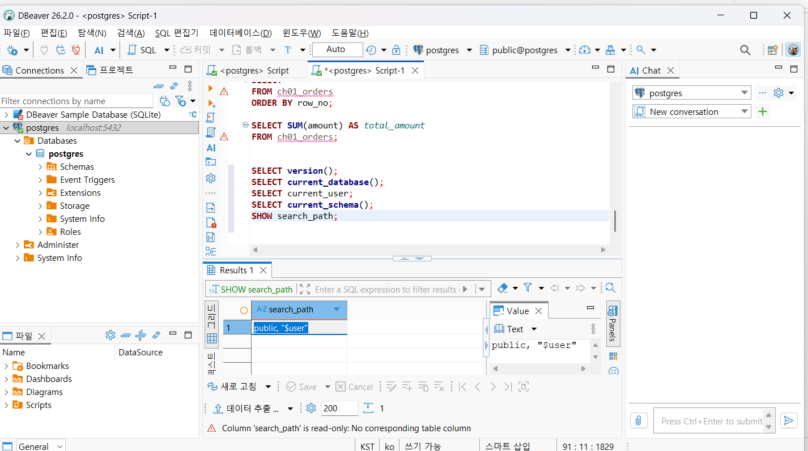
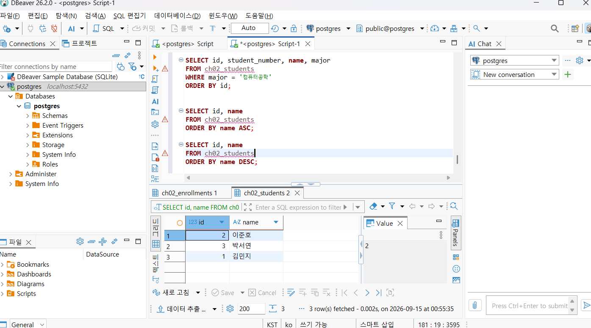
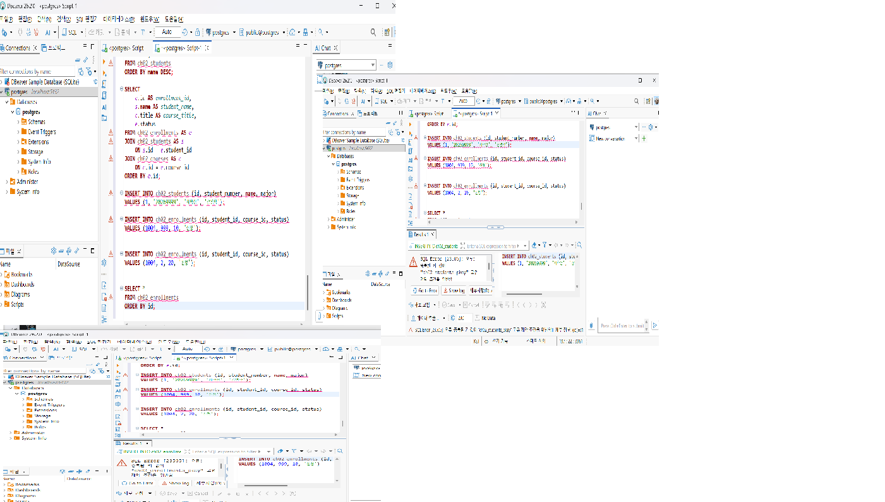
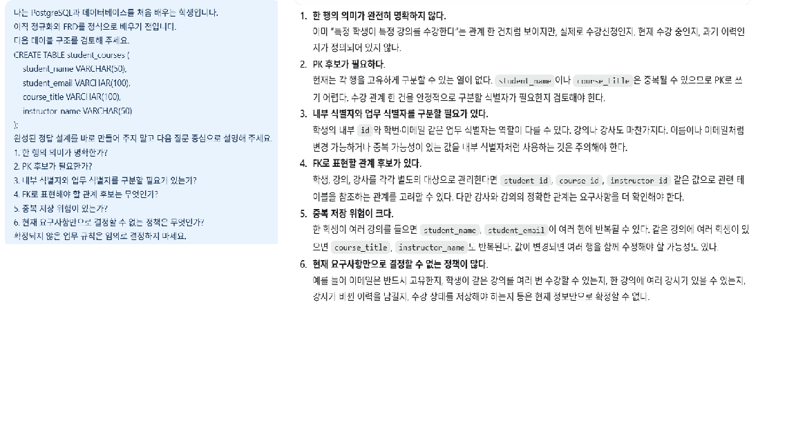

# Chapter 02 확장 실습 답안 템플릿

> **과제:** 데이터와 DBMS의 기본 개념  
> **사용 방법:** 이 파일을 내려받아 본인의 GitHub 저장소에 `chapter02_answer.md`라는 이름으로 저장한 뒤 실습하면서 바로 작성합니다.  
> **제출 방법:** LMS에는 파일을 직접 업로드하지 않고, **본인 GitHub 저장소의 `chapter02_answer.md` 파일 URL**을 제출합니다.

---

## 제출 전 개인정보 주의

LMS에서 제출자를 확인할 수 있으므로 이 공개 Markdown 파일에 학번이나 실명을 반드시 적을 필요는 없습니다.

```text
GitHub 계정 또는 별칭:
과제 작성일:
사용한 AI 도구:
```

> 실제 비밀번호, API Key, 전체 DB 접속 URL, 개인정보가 포함된 화면은 올리지 않습니다.

---

# 1. PostgreSQL에서 현재 위치 확인

## 1-1. 실행한 SQL

```sql
SELECT version();
SELECT current_database();
SELECT current_user;
SELECT current_schema();
SHOW search_path;
```

## 1-2. 실행 결과 기록

```text
PostgreSQL 버전:PostgreSQL 18.6 on x86_64-windows, compiled by msvc-19.44.35228, 64-bit
현재 데이터베이스:postgres
현재 사용자:postgres
현재 스키마:public
search_path:public, "$user"
```

## 1-3. 구조를 내 말로 설명

```text
PostgreSQL은:dbms이고 실제로 데이터베이스를 저장하고 관리하는 프로그램이다

현재 접속한 데이터베이스는:실제 데이터가 저장되는곳이다

스키마는:table을 묶는 폴더의 개념이다

DBeaver 또는 psql 같은 도구는: dbms를 쉽게 사용하기 위한 도구이다
```

## 1-4. 계층 구조 완성

```text
사용자
→ DBeaver
→ PostgreSQL DBMS
→ 데이터베이스
→ 스키마
→ 테이블
→ 행 / 열
```

## 1-5. 증거 화면

권장 경로:

```text
assignments/chapter02/images/step01_environment.png
```

```markdown

```

`여기에 STEP 1 핵심 증거 화면을 삽입하세요.`

---

# 2. 데이터베이스 안의 스키마와 테이블 관찰

## 2-1. 스키마 조회 결과

실행한 SQL:

```sql
SELECT schema_name
FROM information_schema.schemata
ORDER BY schema_name;
```

관찰한 스키마 이름 중 3개 이내를 적습니다.

```text
1.information_schema
2.pg_catalog
3.pg_toast
```

### `public`은 무엇인가요?

```text
나의 설명:데이터베이스 안에 있는 한 스키마이다.
```

### 데이터베이스와 스키마는 같은 것인가요?

```text
나의 설명:다르다. 스키마는 데이터베이스 안에 들어가는 폴더 개념이다
```

## 2-2. 현재 보이는 테이블 조회

```sql
SELECT table_schema, table_name
FROM information_schema.tables
WHERE table_type = 'BASE TABLE'
  AND table_schema NOT IN ('pg_catalog', 'information_schema')
ORDER BY table_schema, table_name;
```

```text
조회된 사용자 테이블 수 또는 눈에 띈 테이블: practice.table

아직 테이블이 거의 없어도 괜찮은 이유:postgresql이 설치되었다고 해도 수업용 테이블이 자동으로 만들어지는게 아니기 때문
```

## 2-3. 관찰 정리

```text
PostgreSQL 서버 안에는 여러 _____데이터베이스__________가 있을 수 있다.
한 데이터베이스 안에는 여러 ________스키마___가 있을 수 있다.
스키마 안에는 테이블과 같은 _______객체______가 존재한다.
```

---

# 3. TEMP TABLE로 테이블·행·열·키 직접 확인

## 3-1. 임시 테이블 생성 완료 확인

- [ ] `ch02_students` 생성
- [ ] `ch02_courses` 생성
- [ ] `ch02_enrollments` 생성

각 테이블의 **한 행 의미**를 적습니다.

| 테이블 | 한 행의 의미 |
| --- | --- |
| `ch02_students` | 학생 한명 |
| `ch02_courses` | 강의 한개 |
| `ch02_enrollments` | 특정 학생이 특정 강의를 신청한 사건 한 건 |

## 3-2. 열의 의미 확인

### `ch02_students`

| 열 | 값의 의미 | 내부 식별자 / 업무 식별자 / 일반 속성 |
| --- | --- | --- |
| `id` | DB 내부에서 학생 행을 구분하는 내부 식별자 후보 |내부식별자  |
| `student_number` | 학교 업무에서 사용하는 업무 식별자 후보 | 업무식별자 |
| `name` | 학생이름 | 일반속성 |
| `major` | 전공 | 일반속성 |

### `ch02_enrollments`

| 열 | 값의 의미 | PK / FK / 일반 속성 |
| --- | --- | --- |
| `id` |DB 내부에서 학생 행을 구분하는 내부 식별자 후보  | pk |
| `student_id` | 학생 구분하는 id | fk |
| `course_id` | 강의 구분하는 id | fk |
| `status` | 수강신청상태 | 일반속성 |

## 3-3. 입력된 행 수

```text
students 행 수:3
courses 행 수:2
enrollments 행 수:3
```

## 3-4. 내부 식별자와 업무 식별자

```text
students.id가 필요한 이유:테이블 내에서 학생 행을 구분하기 위해

student_number가 필요한 이유:그 학생의 속성이기 때문

둘을 항상 같은 값으로 사용하지 않아도 되는 이유:students.id는 DB 내부에서 행을 안정적으로 구분하기 위한 값이고, student_number는 실제 업무에서 사용하는 값이라 역할이 다르기 때문이다.
학번 체계가 바뀌어도 내부 id는 그대로 유지할 수 있다.
```

## 3-5. 숫자처럼 보이는 학번을 문자열로 저장한 이유

```text
나의 설명:앞자리에 0이 들어가면 없어지기 때문에 문자열로 저장을 한다
```

---

# 4. 테이블과 조회 결과는 다르다

## 4-1. 원본 테이블 행 수

```text
ch02_students 전체 행 수:3
```

## 4-2. 일부 열만 조회

실행 SQL:

```sql
SELECT name, major
FROM ch02_students
ORDER BY id;
```

```text
원본 테이블의 열 수와 조회 결과의 열 수가 다른 이유: 일부 열만 선택해서 조회를 한것이기 때문이다
```

## 4-3. 조건을 적용한 조회

실행 SQL:

```sql
SELECT id, student_number, name, major
FROM ch02_students
WHERE major = '컴퓨터공학'
ORDER BY id;
```

```text
원본 테이블 행 수:3
조회 결과 행 수:2
원본 테이블의 데이터가 삭제된 것인가?:삭제된게 아니라 일부만 조회된거다
그렇게 판단한 이유:조건에 맞는 데이터만 필터링 해서 조회해서 보여주는것이기 때문
```

## 4-4. 정렬 결과 비교

```sql
SELECT id, name
FROM ch02_students
ORDER BY name ASC;

SELECT id, name
FROM ch02_students
ORDER BY name DESC;
```

```text
ASC 결과의 첫 학생:김민지
DESC 결과의 첫 학생:이준호

이 실험을 통해 ORDER BY에 대해 알게 된 점:order by를 통해 결과순서를 다르게 조회할 수 있다
```

## 4-5. 증거 화면

권장 경로:

```text
assignments/chapter02/images/step04_result_set.png
```

`여기에 STEP 4 핵심 증거 화면을 삽입하세요.`
---


---

# 5. PK와 FK를 실제로 관찰

## 5-1. 정상 데이터의 관계 읽기

다음 SQL 결과를 보고 작성합니다.

```sql
SELECT
    e.id AS enrollment_id,
    s.name AS student_name,
    c.title AS course_title,
    e.status
FROM ch02_enrollments AS e
JOIN ch02_students AS s
    ON s.id = e.student_id
JOIN ch02_courses AS c
    ON c.id = e.course_id
ORDER BY e.id;
```

```text
한 행이 의미하는 것:

같은 student_id가 여러 enrollment 행에서 반복될 수 있는 이유:학생1명이 여러 수강신청을 할 수 있기 때문

같은 course_id가 여러 enrollment 행에서 반복될 수 있는 이유:강좌 1개를 여러 명이 수강신청 할 수 있기 때문
```

## 5-2. 기본키 중복 오류 관찰

중복 PK 입력을 시도한 결과:

```text
실행 성공 / 실패: 실패
오류 메시지에서 확인한 핵심 단어:duplicate key value 
왜 실패했다고 생각하는가:pk는 테이블 내에서 행을 구분하는 고유키 개념인데 이걸 중복해서 사용할 순 없다
```

## 5-3. 존재하지 않는 학생을 참조하는 FK 오류 관찰

존재하지 않는 `student_id`를 사용한 수강신청 입력 결과:

```text
실행 성공 / 실패:실패
오류 메시지에서 확인한 핵심 단어:foreign key
왜 실패했다고 생각하는가:student_id가 fk로 사용되는데 존재하지 않는 id를 입력했기 때문
```

## 5-4. PK와 FK의 차이 정리

```text
PK는 같은 테이블 안에서 각 행을 구분 하기 위한 키이다.

FK는 다른 테이블의 행을 참조하여 테이블 사이의 관계를 연결 하기 위한 키이다.

FK 값이 여러 행에서 반복될 수 있는 이유는
한 부모 행이 여러 자식 행과 연결되는 1:N 관계가 가능하기 때문이다.
```

## 5-5. 증거 화면

권장 경로:

```text
assignments/chapter02/images/step05_pk_fk.png
```

> 오류 메시지는 전체 화면이 아니라 테이블명·constraint·참조 오류가 보이는 정도만 캡처합니다.

`여기에 STEP 5 핵심 증거 화면을 삽입하세요.`

---


---

# 6. 관계와 카디널리티를 자연어로 설명

현재 임시 데이터 기준으로 작성합니다.

```text
학생 한 명은 여러 수강신청을 가질 수 있는가?: yes

강의 한 개는 여러 수강신청을 가질 수 있는가?: yes

수강신청 한 건은 학생 몇 명을 참조하는가?: 학생 한 명

수강신청 한 건은 강의 몇 개를 참조하는가?: 강의 한 개
```

아래 구조를 완성합니다.

```text
students 1 ── N enrollments N ── 1 courses
```

### 학생과 강의가 N:M 관계라고 볼 수 있는 이유

```text
나의 설명: 학생 한명이 강의 여러개를 신청 가능하고, 강의 한개를 학생 여러명이 신청가능하기 때문이다
```

> 아직 0개 허용 여부, 필수 관계, 삭제 정책까지 확정하지 않습니다. 그런 규칙은 Chapter 05~06에서 다룹니다.

---

# 7. AI가 만든 테이블 구조 직접 검토

## 7-1. AI에게 묻기 전에 내가 먼저 찾은 문제

다음 구조를 보고 최소 4개를 적습니다.

```sql
CREATE TABLE student_courses (
    student_name VARCHAR(50),
    student_email VARCHAR(100),
    course_title VARCHAR(100),
    instructor_name VARCHAR(50)
);
```

```text
문제 1. 각 행을 고유하게 구분할 수 있는 pk가 없다
문제 2. 강의 id가 없어서 같은 제목의 강의가 있으면 중복될 수 있다
문제 3. 학생 id가 없어서 동명이인이 있으면 구분하기 어렵다
문제 4. 학생 정보, 강의 정보, 강사 정보가 한 테이블에 다 들어가있어서 정보가 너무 많다
```

## 7-2. AI 검토 요청 프롬프트

사용한 핵심 프롬프트를 기록합니다.

```text
나는 PostgreSQL과 데이터베이스를 처음 배우는 학생입니다.
아직 정규화와 ERD를 정식으로 배우기 전입니다.
다음 테이블 구조를 검토해 주세요.

CREATE TABLE student_courses (
    student_name VARCHAR(50),
    student_email VARCHAR(100),
    course_title VARCHAR(100),
    instructor_name VARCHAR(50)
);

완성된 정답 설계를 바로 만들어 주지 말고 다음 질문 중심으로 설명해 주세요.

1. 한 행의 의미가 명확한가?
2. PK 후보가 필요한가?
3. 내부 식별자와 업무 식별자를 구분할 필요가 있는가?
4. FK로 표현해야 할 관계 후보는 무엇인가?
5. 중복 저장 위험이 있는가?
6. 현재 요구사항만으로 결정할 수 없는 정책은 무엇인가?
확정되지 않은 업무 규칙은 임의로 결정하지 마세요.

```

## 7-3. AI 제안과 나의 판단

| AI의 지적 또는 제안 | 동의 / 수정 / 보류 | 나의 근거 |
| --- | --- | --- |
|한 행의 의미가 완전히 명확하지 않다  | 동의 | 특정학생과 특정강의를 연결짓긴하지만, 실제로 수강신청인지 과거 이력인지 무엇을 뜻하는지 명확하지 않다 |
| PK후보가 필요하다 | 동의 | 현재는 각 행을 고유하게 구분할 수 있는 열이 없기 때문 |
| FK로 표현할 관계 후보가 없다 | 동의 | 학생, 강의, 강사를 각각 별도의 대상으로 관리를 한다면, id와 같은 값으로 관련 테이블을 참조하는 관계를 고려할 수 있기 때문 |
| 내부 식별자와 업무 식별자를 구분할 필요가 있다 | 동의 | 이름이나 이메일처럼 변경 가능하거나 중복가능한 값들을 내부 식별자처럼 사용하는것은 어렵기때문 |
| 중복 저장 위험이 크다 | 동의 | 한 학생이 여러 강의를 들으면 여러 행에 같은 값들이 반복될 수 있다 |

## 7-4. 본문과 대조한 항목

AI 설명 중 최소 하나를 `chapter02.md`와 비교합니다.

```text
AI가 설명한 내용:학생, 강의, 강사를 각각 별도로 관리한다면 student_id, course_id, instructor_id 같은 값으로 다른 테이블을 참조하는 FK 관계를 고려할 수 있다고 설명했다.


본문에서 확인한 내용:FK는 다른 테이블의 행을 참조해서 테이블 사이의 관계를 연결하는 키이고, 1:N 관계에서는 같은 FK 값이 여러 행에서 반복될 수 있다고 설명하고 있다.

일치 / 부분 일치 / 수정 필요: 일치

내가 최종적으로 이해한 내용:FK는 다른 테이블의 PK를 참조해서 테이블 사이의 관계를 표현하는 데 사용한다. 또한 FK는 PK와 달리 반드시 고유할 필요는 없고, 1:N 관계에서는 같은 값이 여러 행에서 반복될 수 있다.
```

## 7-5. 증거 화면

권장 경로:

```text
assignments/chapter02/images/step07_ai_review.png
```

`여기에 AI 검토 과정의 핵심 화면을 삽입하세요.`


---

# 8. Chapter 01의 개인 서비스 아이디어를 DB 용어로 다시 표현

Chapter 01에서 정한 개인 서비스 주제를 그대로 사용하거나 새 주제를 정해도 됩니다.

## 8-1. 서비스 기본 정보

```text
서비스 이름: 영화관 예매
서비스 목적: 사용자가 영화, 상영관, 상영 시간을 확인하고 원하는 좌석을 선택해 영화표를 예매할 수 있도록 하는 서비스
```

## 8-2. PostgreSQL 구조 후보

```text
데이터베이스 이름 후보:ai_database_study
스키마 이름 후보:movie_booking
```

> 아직 실제 데이터베이스나 스키마를 생성하지 않아도 됩니다.

## 8-3. 테이블 후보와 한 행 의미

최소 3개를 작성합니다.

| 테이블 후보 | 한 행의 의미 | 내부 ID 후보 | 업무 식별자 후보 |
| movies | 영화 한 편 | movies.id | 영화코드 |
| screenings | 특정 영화의 특정 날짜, 시간, 상영 한 회차 | screening.id | 상영회차 코드 |
| reservations |사용자의 영화 예매 한건  |reservation.id  |예매번호  |
| users | 사용자 한명 | user.id | 이메일 |

## 8-4. FK 후보

```text
1. reservations.user_id → users.id
   이유:어떤 사용자가 한 예매인지 연결하기 위해

2. reservations.screening_id → screenings.id
   이유:어떤 상영 회차를 예매했는지 연결하기 위해
```

## 8-5. 자연어 관계 문장

```text
1.한 사용자는 여러 영화를 예매할 수 있다
2.한 영화는 여러 사용자가 예매할 수 있다
3.예약 한 건은 한 사용자를 참조한다
```

## 8-6. 아직 확정하지 않을 정책

```text
Q1.한 사용자가 같은 상영 회차를 여러번 예매할 수 있는가
Q2.예매를 취소했을때 해당 예매 기록을 삭제할 것인지, 혹은 취소상태로 남길것인지
Q3.상영 시작 몇분전까지 예매와 취소를 허락할것인가
```

---

# 9. AI를 개인 구조의 검토자로 사용

## 9-1. 사용한 프롬프트

```text
나는 데이터베이스 초보자입니다.
Chapter 02까지 학습했고 아직 ERD와 정규화는 정식으로 배우지 않았습니다.
내 서비스 구조 초안은 다음과 같습니다.
서비스 이름: 영화관 예매
테이블 후보와 한 행 의미:
| movies | 영화 한 편  
| screenings | 특정 영화의 특정 날짜, 시간, 상영 한 회차 
| reservations |사용자의 영화 예매 한건 
| users | 사용자 한명

내부 식별자 후보:
| movies.id |
| screening.id|
|reservation.id|
| user.id| 

업무 식별자 후보:
영화코드
상영회차 코드
예매번호
이메일

FK 후보:

1. reservations.user_id → users.id
   이유:어떤 사용자가 한 예매인지 연결하기 위해

2. reservations.screening_id → screenings.id
   이유:어떤 상영 회차를 예매했는지 연결하기 위해

미확정 정책:
Q1.한 사용자가 같은 상영 회차를 여러번 예매할 수 있는가
Q2.예매를 취소했을때 해당 예매 기록을 삭제할 것인지, 혹은 취소상태로 남길것인지
Q3.상영 시작 몇분전까지 예매와 취소를 허락할것인가

정답 설계를 대신 작성하지 말고 다음을 질문 형태로 검토해 주세요.
1. DBMS / database / schema / table을 혼동한 곳
2. 한 행 의미가 모호한 곳
3. 내부 식별자와 업무 식별자를 혼동한 곳
4. PK와 FK 역할을 잘못 이해한 곳
5. FK가 필요한데 빠진 관계 후보
6. 아직 업무 담당자에게 확인해야 할 정책
근거 없이 정책을 확정하지 마세요.
```

## 9-2. AI가 질문한 내용 중 유용했던 것

```text
1.DBMS / database / schema / table을 혼동한 곳
- 현재 초안에는 movies, screenings, reservations, users를 테이블 후보로 적었는데, 이것들이 모두 테이블 이름 후보라는 점은 구분되어 있는가?
- PostgreSQL 자체를 데이터베이스 이름으로 생각하고 있지는 않은가?
- 데이터베이스 이름과 스키마 이름 후보는 별도로 정할 필요가 있지 않은가?

2.한 행 의미가 모호한 곳
- movies의 한 행이 영화 한 편이라는 의미는 충분히 명확한가?
- screenings의 한 행이 “특정 영화의 특정 날짜·시간 상영 한 회차”라는 의미로 명확한가?
- reservations의 한 행이 예매 한 건이라는 점은 명확한가?
- 만약 한 번의 예매에 좌석 여러 개가 포함될 수 있다면, reservations 한 행이 예매 전체 한 건인지, 좌석 한 건인지 추가 확인이 필요하지 않은가?

3.내부 식별자와 업무 식별자를 혼동한 곳
- movies.id, screening.id, reservation.id, user.id는 DB 내부에서 행을 구분하기 위한 내부 식별자 후보로 이해하고 있는가?
- 테이블 이름이 screenings, reservations, users라면 내부 식별자 표기도 screenings.id, reservations.id, users.id처럼 일관되게 쓰는 것이 더 낫지 않은가?
- 이메일은 사용자를 업무상 구분하는 후보가 될 수 있지만, 변경될 가능성이 있는 값인데 업무 식별자로 사용해도 되는지는 추가 확인이 필요하지 않은가?

```

## 9-3. AI가 너무 빨리 결정한 내용 또는 내가 보류한 내용

```text
1.
2.
```

## 9-4. 검토 후 수정한 구조

| 수정 전 | 수정 후 | 수정 이유 |
| --- | --- | --- |
| screening.id | screenings.id | 내부식별자를 테이블명에 맞춰 작성 |
| reservation.id | reservations.id | 내부식별자를 테이블명에 맞춰 작성 |
| user.id | users.id |내부식별자를 테이블명에 맞춰 작성 |

---

# 10. 최종 개념 정리

아래 문장을 본인의 말로 완성합니다.

```text
PostgreSQL은  데이터베이스를 실제로 저장하고 관리하는 프로그램 이다.

DBeaver 또는 psql은 postgresql에 sql을 전달하고 결과를 확인하는 프로그램 이다.

데이터베이스와 스키마의 차이는 데이터베이스 안에 스키마라는 폴더가 존재하는것 이다.

테이블 한 행은 그 테이블이 의미하는 객체 하나를 의미하는것 이다.

조회 결과가 원본 테이블과 다른 이유는 조건에 따라 조회결과는 달라지기 때문 이다.

내부 식별자와 업무 식별자의 차이는 내부에서 구분용인지, 실제 업무에서 구분용인지에 차이가 있기때문 이다.

PK는 각 행을 구분하는 키 이다.

FK는 다른 테이블의 행을 참조해서 관계를 연결하는 키 이다.
```

---

# 11. 이번 Chapter에서 새롭게 알게 된 점

최소 3개를 작성합니다.

```text
1.pk와 fk의 관계와 차이에 대해서 이해했다
2.데이터타입의 중요성에 대해 알게되었다
3.table의 한 행이 의미하는 것을 명확하게 하는것이 중요하다는것을 알게되었다
```

## 아직 헷갈리는 내용

```text
1. 내부 식별자와 pk가 역할이 비슷해보이지만 개념상으로 차이가 있는게 아직은 헷갈린다
2.
```

## AI에게 다시 질문하고 싶은 내용

```text

```

---

# 12. 제출 전 자기 점검

- [ ] PostgreSQL에서 현재 database / schema / search_path를 확인했다.
- [ ] DBMS, database, schema, table을 구분해서 설명할 수 있다.
- [ ] TEMP TABLE 3개를 생성하고 직접 데이터를 조회했다.
- [ ] 각 테이블의 한 행 의미를 작성했다.
- [ ] 테이블과 조회 결과가 다르다는 것을 실제 SQL로 확인했다.
- [ ] `ORDER BY`를 사용하지 않으면 업무 순서를 가정하면 안 된다는 점을 이해했다.
- [ ] 내부 식별자와 업무 식별자의 차이를 설명할 수 있다.
- [ ] PK 중복 입력 실패를 직접 확인했다.
- [ ] 존재하지 않는 FK 참조 실패를 직접 확인했다.
- [ ] FK 값이 반복될 수 있는 이유를 설명할 수 있다.
- [ ] AI가 만든 테이블을 내가 먼저 검토했다.
- [ ] AI 설명 중 최소 하나를 본문과 대조했다.
- [ ] 개인 서비스의 테이블 후보를 3개 이상 작성했다.
- [ ] 개인 서비스의 FK 후보와 미확정 정책을 기록했다.
- [ ] 실제 비밀번호·API Key·민감한 접속 정보가 포함되지 않았는지 확인했다.
- [ ] 이미지 링크가 GitHub에서 정상적으로 보이는지 확인했다.

---

# 13. GitHub 제출 정보

답안 파일 권장 위치:

```text
assignments/chapter02/chapter02_answer.md
```

이미지 권장 위치:

```text
assignments/chapter02/images/
```

LMS 제출 URL 형식:

```text
https://github.com/<본인-GitHub-ID>/<본인-저장소>/blob/main/assignments/chapter02/chapter02_answer.md
```

## 최종 확인

- [ ] 위 URL을 로그아웃 상태 또는 다른 브라우저에서 열어도 확인 가능하다.
- [ ] Markdown이 정상 렌더링된다.
- [ ] 이미지가 깨지지 않는다.
- [ ] LMS에 교수자 템플릿 URL이 아니라 **내 답안 파일 URL**을 제출했다.
