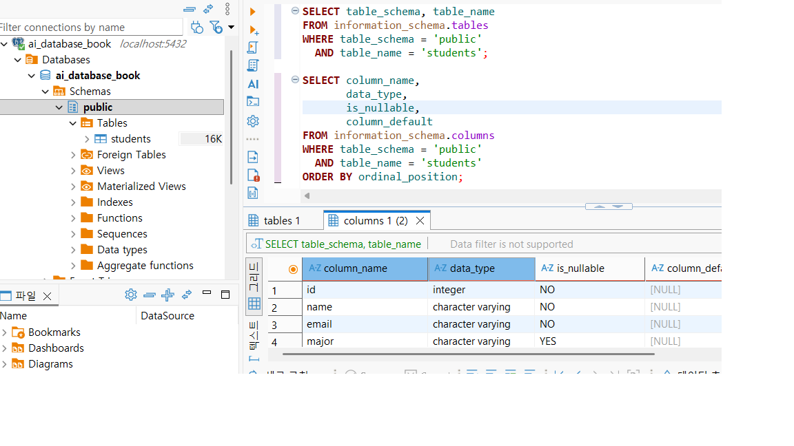
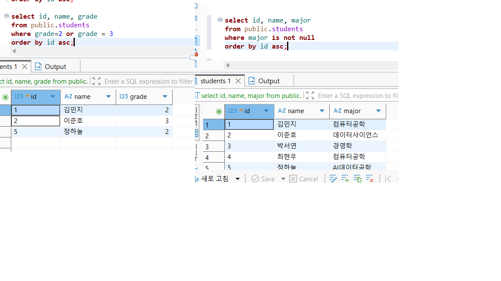
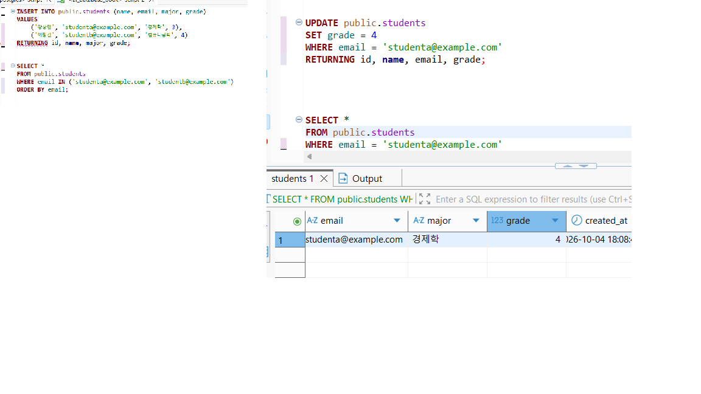
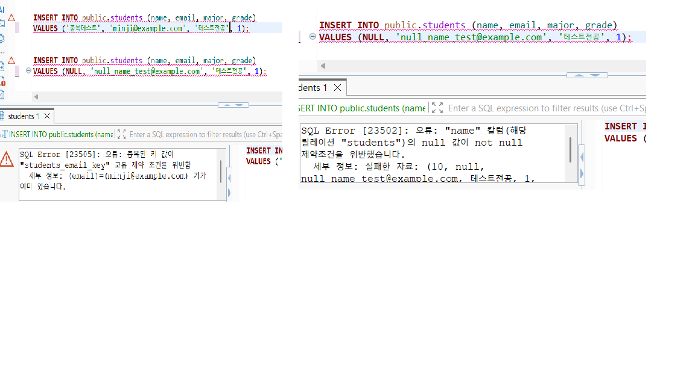

# Chapter 04 확장 실습 답안 템플릿

> **과제:** 관계형 데이터베이스와 SQL 시작하기  
> **사용 방법:** 이 파일을 내려받아 본인의 GitHub 저장소에 `chapter04_answer.md`라는 이름으로 저장한 뒤 실습하면서 바로 작성합니다.  
> **제출 방법:** LMS에는 파일을 직접 업로드하지 않고, **본인 GitHub 저장소의 `chapter04_answer.md` 파일 URL**을 제출합니다.

---

## 제출 전 주의

이 파일과 캡처 화면에는 실제 비밀번호, 전체 DB 접속 URL, API Key, 개인정보를 기록하지 않습니다.

```text
GitHub 계정 또는 별칭:chxxl
과제 작성일:10/04
사용한 AI 도구:gpt
```

---

# 1. 실습 환경과 시작 상태 확인

다음을 실행합니다.

```sql
SELECT current_database();
SELECT current_user;
SELECT current_schema();
SHOW search_path;
SHOW transaction_read_only;
```

| 확인 항목 | 실제 결과 | 의미 |
| --- | --- | --- |
| current_database() | ai_database_book | 현재 연결되어있는 데이터베이스 |
| current_user | postgres | 현재 sql을 실행하는 데이터베이스 사용자 |
| current_schema() | public | 현재 기본으로 지정된 스키마 |
| search_path | public, "$user" | 테이블 이름에 스키마를 생략했을때 어떤 스키마 순서로 찾을지 |
| transaction_read_only | off | 읽기 전용이 아니라서 수정이 가능하다 |

- [o] 현재 DB가 `ai_database_book`이다.
- [o] 변경 가능한 연결인지 확인했다.
- [o] 실행할 SQL 범위를 확인했다.
- [o] Auto-commit 상태를 확인했다.

### 변경 SQL을 실행하기 전에 현재 DB와 실행 범위를 확인해야 하는 이유

```변경 sql은 데이터베이스의 실제 데이터를 수정하거나 삭제할 수 있기 때문에, 실행하기 전에 현재 연결된 db와 실행범위를 확인해서 의도치않은 수정을 방지해야한다.

```

---

# 2. `public.students` 구조 생성

## 2-1. 실행 전 예상

```text
테이블 이름: students
한 행의 의미:학생 1명의 정보
예상 행 수:0
기본키:id
필수 열:name, email, created_at
중복을 막는 열:email
자동 생성 열:created_at
```

## 2-2. 실행 파일

```text
code/chapter04/01_create_students.sql
```

## 2-3. 실행 후 확인

```text
테이블 생성 성공 여부:o
실제 행 수:0
DBeaver에서 확인한 위치:ai_database_book.public.students
```

### 각 열의 역할

| 열 | 타입 | NULL 가능? | 역할 |
| --- | --- | --- | --- |
| id |integer|No|각 학생을 구분하는 key |
| name | character varying |Np |학생이름|
| email |character varying|No |학생이메일 |
| major |character varying|Yes|학생전공|
| grade |integer|Yes|학생학년 |
| created_at |timestamp with time zone|No |데이터생성시각 |

### `id`를 학번이나 학생 수로 해석하면 안 되는 이유

```id는 각 행을 구분하기 위해 사용하는 내부식별자이다. 따라서 실제 학번이랑 다른 의미를 가진다. 또한 id 값이랑 학생 수 값이랑 다를수 있다.

```

### 증거 화면

권장 경로:

```text
assignments/chapter04/images/step02_table.png
```



---

# 3. 샘플 데이터 6명 입력

## 3-1. 실행 전 예상

```text
현재 행 수:0
실행 후 예상 행 수:6
예상되는 NULL 포함 학생:1
```

## 3-2. 실행 파일

```text
code/chapter04/02_insert_students.sql
```

## 3-3. 실제 결과

```text
실제 행 수:6
이준호 grade:3
박서연 존재 여부:O
윤서진 major:null
윤서진 grade:null
```

### 예상과 실제 비교

```text
예상과 실제가 일치했는가:일치
다르다면 이유:
```

### `created_at` 값이 여러 행에서 같을 수 있는 이유

```같은 트랜잭션 안에서 여러행을 연속해서 추가하면 같은 시간값이 들어갈수있다. 그래서 created_at이 각 행을 고유하게 구분하는게 아니다

```

---

# 4. SELECT 복습과 결과 검증

각 문제는 **SQL 실행 전에 예상 행 수를 먼저 작성**합니다.

| 번호 | 조회 문제 | 예상 행 수 | 실제 행 수 | 일치? | 다르면 이유 |
| ---: | --- | ---: | ---: | --- | --- |
| 1 | 전체 학생 | 6 |  | 6 | o |
| 2 | 이름·이메일만 조회 |  |  |  |  |
| 3 | 특정 전공 | 2 | 2 | o |  |
| 4 | 특정 학년 이상 | 2 | 2 | o |  |
| 5 | 두 전공 중 하나 |3 | 3| o|  |
| 6 | `grade IS NULL` |  |  |  |  |
| 7 | 전공 `DISTINCT` | 4 | 4 | o |  |
| 8 | 정렬 후 상위 3명 | 윤서진 정하늘 최현우 |윤서진 정하늘 최현우 |o|  |

## 4-1. 내가 직접 작성한 SQL 2개

```sql
-- 
select id, name, major
from public.students
where major is not null 
order by id asc;
```

```text
이 SQL의 한 행 의미:전공이 null이 아닌 학생들을 보여줘
예상 행 수:5
실제 행 수:5
```

```sql
select id, name, grade
from public.students
where grade=2 or grade = 3
order by id asc;
```

```text
이 SQL의 한 행 의미:2학년또는 3학년인 학생들을 보여줘
예상 행 수:3
실제 행 수:3
```

## 4-2. `= NULL` 대신 `IS NULL`을 사용하는 이유

```null은 값이 없거나 알수없다는 뜻이므로 일반적인 = 연산자로는 비교할수없다.

```

## 4-3. `ORDER BY` 없이 결과 순서를 믿으면 안 되는 이유

```oredr by가 없으면 같은 sql이라도 출력순서가 달라질수 있기 때문에 믿으면 안된다
```

## 4-4. `DISTINCT`가 원본 데이터를 삭제하는 기능인가요?

```distinct는 조회 결과에서 중복된 값을 보여주는것이기 때문에 실제 데이터를 삭제하는것은 아니다

```

### 증거 화면

권장 경로:

```text
assignments/chapter04/images/step04_select.png
```


---

# 5. 내 가상 학생 2명 추가

실명·실제 이메일 대신 가상 데이터를 사용합니다.

## 5-1. 실행 전 계획

```text
학생 A
이름:강창민
이메일:studenta@example.com
전공:경제학
학년:3

학생 B
이름:이창건
이메일:studentb@example.com
전공:컴퓨터공학
학년 또는 NULL:4

현재 행 수:6
추가 후 예상 행 수:8
```

## 5-2. 내가 실행한 INSERT

INSERT INTO public.students (name, email, major, grade)
VALUES
    ('강창민', 'studenta@example.com', '경제학', 3),
    ('이창건', 'studentb@example.com', '컴퓨터공학', 4)
RETURNING id, name, major, grade;
```

## 5-3. 실제 결과

```text
RETURNING 또는 확인 SELECT 결과:8
실제 전체 행 수:8
예상과 일치 여부:o
```

### 내가 일부 값을 NULL로 둔 이유 또는 NULL을 사용하지 않은 이유

```null을 사용하지 않고 그냥 값을 지정하고 싶었기 때문

```

---

# 6. 안전한 UPDATE

내가 추가한 가상 학생 한 명만 수정합니다.

## 6-1. 먼저 대상 확인 SELECT

```SELECT *
FROM public.students
WHERE email = 'studena@example.com';

```

```text
예상 대상 행 수:1
실제 대상 행 수:1
```

## 6-2. UPDATE

```UPDATE public.students
SET grade = 4
WHERE email = 'studenta@example.com'
RETURNING id, name, email, grade;

```

```text
예상 영향 행 수:1
실제 영향 행 수:1
RETURNING 결과:grade가 3에서 4로 바뀜
```

## 6-3. UPDATE 후 재조회

```SELECT *
FROM public.students
WHERE email = 'studenta@example.com'

```

### `WHERE` 없는 UPDATE를 실행하면 위험한 이유

```특정 행이 아닌 모든 행을 변경할 위험이 있다

```

### 증거 화면

권장 경로:

```text
assignments/chapter04/images/step06_update.png
```


---

# 7. 안전한 DELETE

내가 추가한 가상 학생 한 명을 삭제합니다.

## 7-1. 삭제 전 확인

```SELECT *
FROM public.students
WHERE email = 'studentb@example.com';

```

```text
예상 대상 행 수:1
실제 대상 행 수:1
```

## 7-2. DELETE

```DELETE FROM public.students
WHERE email = 'student_b@example.com'
RETURNING id, name, email;

```

```text
예상 영향 행 수:1
실제 영향 행 수:1
RETURNING 결과:삭제돼서 행이 안보인다
```

## 7-3. 삭제 후 재조회

```
SELECT *
FROM public.students
WHERE email = 'studentb@example.com';

```

```text
삭제 후 같은 조건의 SELECT 결과 행 수:0
```

### `DELETE` 성공 메시지만 보고 끝내지 않고 다시 SELECT해야 하는 이유

```실제로 삭제가 되었는지 확인을 하기 위해서

```

---

# 8. 본문 기준 UPDATE·DELETE 상태 검증

`04_update_delete_students.sql`을 본문 시작 상태에서 실행했다면 다음을 확인합니다.

```text
최종 학생 수:5
이준호 grade:4
박서연 존재 여부:x
```

본문 기준 기대 상태와 비교합니다.

```text
학생 수 = 5
이준호 grade = 4
박서연 = 0행
```

### 내 실제 결과가 기준과 다르다면 원인

```text

```

---

# 9. 의도한 실패 2개 관찰

> 실패 테스트는 데이터베이스 규칙이 실제로 데이터를 보호하는지 확인하는 실험입니다.

## 9-1. 중복 이메일 `UNIQUE` 오류

내가 사용한 SQL:

```INSERT INTO public.students (name, email, major, grade)
VALUES ('중복테스트', 'minji@example.com', '테스트전공', 1);

```

```text
오류 메시지 핵심 단서:중복된 키
왜 실패해야 맞는가:이메일은 고유하게 들어가서 중복이 없어야되는데, 중복된 이메일을 insert 하려고 했기 때문이다
어떤 규칙이 작동했는가:unique
실패 후 기존 데이터가 어떻게 유지되었는가:기존데이터는 그대로 유지된다
```

## 9-2. 이름 `NULL` 입력 `NOT NULL` 오류

내가 사용한 SQL:

```
INSERT INTO public.students (name, email, major, grade)
VALUES (NULL, 'null_name_test@example.com', '테스트전공', 1);

```

```text
오류 메시지 핵심 단서: not null 제약조건 위반
왜 실패해야 맞는가:이름은 not null로 넣어야한다는 조건을 걸었기 때문
어떤 규칙이 작동했는가:not null
```

### 실패한 INSERT 뒤 자동 생성 `id` 번호에 빈 구간이 생길 수 있어도 문제라고 단정할 수 없는 이유

```id는 행 식별용 내부번호이고 학생수를 의미하는게 아니다. 따라서 빈 번호가 있어도 문제가 아님
```

### 증거 화면

권장 경로:

```text
assignments/chapter04/images/step09_constraint_error.png
```

`

---

# 10. `verify_students.sql`로 최종 상태 확인

실행 파일:

```text
code/chapter04/verify_students.sql
```

```text
현재 전체 학생 수:5
NULL 개수:윤서진에 2개
이준호 grade:4
박서연 존재 여부:x
현재 데이터 상태에서 예상과 다른 부분:x
```

### 검증 SQL을 따로 두면 좋은 이유

```최종 데이터가 나의 기대 상태와 같은지 검증하기 위해서

```

---

# 11. AI를 SQL 작성자가 아니라 검토자로 활용

먼저 본인이 SQL을 작성한 뒤 AI에게 검토를 요청합니다.

## 11-1. 내가 작성한 SQL

```
UPDATE public.students
SET grade = 1
WHERE email = 'seojin@example.com';

```

## 11-2. AI에게 전달한 핵심 요청

```
나는 PostgreSQL 초보자입니다.
아래 SQL을 바로 다시 작성하지 말고 먼저 안전성을 검토해 주세요.
다음 순서로 답해 주세요.
1. 이 SQL이 영향을 줄 것으로 예상되는 행
2. WHERE 조건이 너무 넓거나 모호하지 않은지
3. NULL 처리에서 주의할 점
4. 실행 전에 같은 조건으로 확인할 SELECT
5. 실행 후 결과를 확인할 SELECT
6. 내가 놓친 위험이 있다면 질문 형태로 제시
UPDATE public.students
SET grade = 1
WHERE email = 'seojin@example.com';
```

## 11-3. AI 검토 결과

| AI 제안 | 수용 / 수정 / 거절 | 실제 검증 결과 | 나의 이유 |
| 정말 seojin@example.com 학생의 학년을 1로 바꾸려는 게 맞나? | 수용 | 맞다 | 누구를 수정하고싶은지 확인 |
|기존 grade 값이 무엇인지 확인했나?|수용|확인했다|기존 grade를 확인해야 이걸 어떤값으로 수정할지 의미가 있기때문이다|
| 현재 올바른 데이터베이스 ai_database_book에서 실행 중인가? |수용 |올바른 곳에서 실행중이다|올바른 데이터베이스에서 실행되어야 내가 원하는 데이터가 수정이 제대로 되기 때문이데|
|  |  |  |  |

### AI가 예상한 영향 행 수와 실제 결과가 같았나요?

```같았다

```

### AI 답변을 실행 전에 검토해야 하는 이유

```ai가 제시한 답변이 문법적으로 맞더라도 사용자의 의도를 정확히 반영하지 못할수도 있다

```

---

# 12. 내 서비스 테이블 하나 확장 설계

Chapter 01~03에서 정한 개인 서비스에서 **테이블 하나**를 선택합니다.

```text
서비스 이름:영화관 예매 서비스
테이블 이름:reservations
한 행의 의미:한 사용자가 예매한 특정 영화 회차 1건
```

| 열 이름 | 저장할 값 | 타입 후보 | NULL 가능? | UNIQUE 후보? | 이유 |
| id |내부식별자 | integer | 불가능 | o | 내부식별자이므로 고유하기 구분하기위해 |
| reservation_number|예매번호|VARCHAR|불가능|o|업무식별자이기 때문|
|user_id|예매한 사용자 id|integer|불가능|x|한사용자가 여러예매 할수있기때문|
|screening_id|예매한 상영회차id|integer|불가능|x|하나의 상영회차를 여러명이 예매할수있기 때문|
|created_at|예매생성시간|TIMESTAMPTZ|불가능|x|예매가 언제 생성되었는지를 보기위해|

```text
PK 후보:id
업무 식별자 후보:reservation_number
아직 미확정인 규칙:한번의 예매로 여러 좌석을 예매할수있는지,중복예매 허용할지
```

## 선택: CREATE TABLE 초안

> 아직 확정되지 않은 업무 규칙은 억지로 제약조건으로 만들지 않습니다.

```sql

```

### AI에게 검토받은 뒤 수정한 부분

```text

```

---

# 13. 최종 성찰

아래 문장은 본인의 말로 작성합니다.

```text
1. SQL 실행 성공과 올바른 대상 선택이 다른 이유는
   내가 의도하지 않은 대상이 선택될수 있기 때문 이다.

2. UPDATE와 DELETE 전에 SELECT를 먼저 해야 하는 이유는
   실제로 어떤 행을 수정할지 확인하기 위해서 이다.

3. 영향받은 행 수를 확인해야 하는 이유는
   내가 원하는 행들만 수정을 했는지 확인하기 위해서 이다.

4. UNIQUE 또는 NOT NULL 오류를 '보호 장치가 정상 동작한 결과'라고 볼 수 있는 이유는
   중복되면 안되는값이나 null을 넣으면 안되는값을 데이터베이스가 막은것이기때문 이다.

5. AI가 SQL을 만들어 주더라도 내가 반드시 확인해야 하는 것은
   내가 원하는 의도와 맞는지 확인해야하는것 이다.
```

---

# 14. 제출 체크리스트

- [ ] `chapter04_answer.md`를 본인 저장소에 만들었다.
- [ ] 현재 DB와 실행 환경을 확인했다.
- [ ] `public.students`를 생성했다.
- [ ] 샘플 6명 입력 결과를 검증했다.
- [ ] SELECT 문제에서 실행 전 예상 행 수를 작성했다.
- [ ] 가상 학생 2명을 추가했다.
- [ ] UPDATE 전후를 SELECT로 확인했다.
- [ ] DELETE 전후를 SELECT로 확인했다.
- [ ] UNIQUE 오류를 관찰했다.
- [ ] NOT NULL 오류를 관찰했다.
- [ ] `verify_students.sql`로 상태를 확인했다.
- [ ] AI 제안을 실제 SQL 결과와 비교했다.
- [ ] 개인 서비스 테이블 하나를 확장 설계했다.
- [ ] 핵심 캡처는 3~4장 정도로 제한했다.
- [ ] 비밀번호·개인정보가 캡처에 없다.
- [ ] Markdown 이미지가 GitHub 웹 화면에서 정상 표시된다.
- [ ] commit/push를 완료했다.

---

# 15. LMS 제출 URL

아래 형식의 **본인 GitHub 파일 URL**을 LMS에 제출합니다.

```text
https://github.com/<본인-GitHub-ID>/<본인-저장소>/blob/main/assignments/chapter04/chapter04_answer.md
```

내 제출 URL:

```text

```

> 교수자 템플릿 URL이나 저장소 메인 URL이 아니라 **작성 완료된 본인 `chapter04_answer.md` 파일 화면 URL**을 제출합니다.
